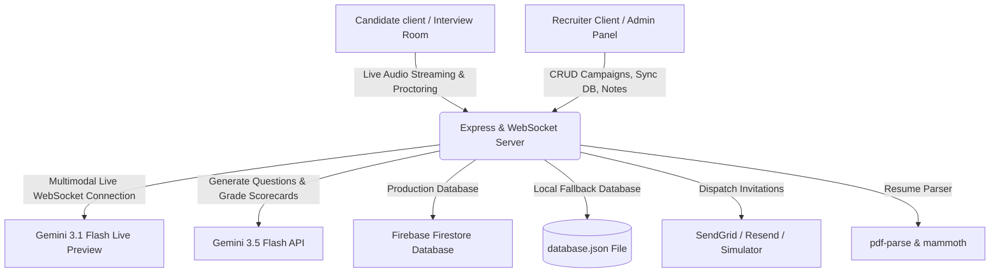

  
  # 🎙️ Rainctew.AI: Next-Gen AI Talent Acquisition & Proctoring Room
  
  [](https://vite.dev/)
  [](https://react.dev/)
  [](https://tailwindcss.com/)
  [](https://ai.google.dev/)
  [](https://firebase.google.com/)
  
  **Raincrew.AI** is a state-of-the-art, high-fidelity AI-powered recruiting and talent acquisition ecosystem. It modernizes traditional voice screening and technical assessments by utilizing the **Google Gemini Multimodal Live WebSocket API** to conduct real-time oral interviews, combined with a comprehensive **biometric and browser proctoring suite** and a deep-dive **evaluation engine** that renders candidate report scorecards, pacing metrics, gap analyses, and collaborative tools.
</div>

---

## 🧭 Project Architecture Overview

Raincrew.AI is built as a unified full-stack application that couples a high-performance **Vite + React 19** frontend with a robust **Node.js Express + WebSocket** backend. It features **Firebase Firestore** as its production database with a local JSON fallback file storage system to guarantee resilient, multi-tenant workspace separation.



---

## ✨ Primary Capabilities & Features

### 1. 🎙️ Duplex WebSocket Voice Interview Room
* **Multimodal Live Integration:** Establishes a passive, low-latency WebSocket connection to `gemini-3.1-flash-live-preview` to stream live microphone capture and receive instant transcriptions and oral responses.
* **Dynamic Voice Sphere Canvas:** Visualizes active audio frequencies on the candidate dashboard using a highly responsive HTML5 Canvas wave animation.
* **On-the-Fly Question Translation:** Integrated language conversion API allows candidates to read and translate interview questions in real-time.
* **GDPR Compliance Biometric Gateway:** A robust pre-flight consent interface that gathers explicit agreement regarding voice analytics and camera feeds.

### 2. 🛡️ Absolute Cheating Prevention & Proctoring Suite
FoloUp operates an integrated integrity tracking monitor that logs and aggregates potential tampering behaviors:
* **Camera Biometric Proctoring:** Optional integration with face-geometry coordinates to monitor visual presence.
* **Tab Switch Tracker:** Registers and flags instances where candidates switch tabs or browser focus.
* **Fullscreen Exit Detection:** Prompts and alerts candidates when they exit the mandatory fullscreen screening environment.
* **Extended Silence Audit:** Auto-detects and counts periods of prolonged speaking pauses.
* **Suspicious Sound/Noise Flags:** Flags sudden audio changes or suspicious secondary background noise.

### 3. 🎯 Intelligent Campaigns & Automated Questions Creator
* **Gemini Question Generator:** Input a Job Title, Description, and Experience Level, and Gemini automatically structures 4 highly tailored, conversational evaluation questions.
* **Custom Weights Matrix:** Customize and weigh evaluation criteria across **Technical Depth**, **Architectural Style**, and **Communication Skills** variables.
* **Configurable Screen Parameters:** Custom-tailor the voice gender (Male/Female), select Speech-to-Text Engines (`Deepgram`, `AssemblyAI`, or `Whisper`), and override default GDPR terminology.

### 4. 🗃️ Dynamic Draggable Kanban Stage Board
* **Visual Status Pipeline:** Easily move candidates across stages (**Applied ➔ Interviewing ➔ Evaluated ➔ Hired ➔ Rejected**) using a native HTML5 drag-and-drop board.
* **Smooth Micro-Animations:** Backed by Framer Motion (`motion/react`) for layout transformations, drag feedback scales, and dynamic list sorting.
* **Safety Confirmation Triggers:** Safety popups prevent accidental deletion of candidate scorecards.

### 5. 📑 AI Resume Parser & Custom Prep
* **Instant Document Processing:** Drag-and-drop resume uploading support for PDF and Word DOCX files (processed using `pdf-parse` and `mammoth`).
* **Candidate Profile Construction:** Instantly populates candidate Name, Contact, and Experience matrices.
* **Personalized Assessment Questions:** Crafts tailored interview screening questions derived from specific past experience listed in the uploaded resume.

### 6. 📊 Hyper-Detailed Candidate Evaluation Scorecards
* **Structured Evaluation Charts:** Utilizes Recharts to render beautiful **Radar Charts** comparing Candidate marks across core criteria.
* **AI Evaluation Summaries:** Provides detailed prose explaining overall performance, explicit strengths, and developmental weaknesses.
* **Audio Delivery Metrics:**
  * **Filler Words Counter:** Tracks and isolates instances of words like `"like"`, `"um"`, `"ah"`, and `"basically"`.
  * **Pacing Analytics:** Computes exact Words Per Minute (WPM) to grade speaking fluency (e.g. *Balanced & Fluent*, *Slow & Deliberate*, or *Rapid & Energetic*).
  * **Accent/Language Identification:** Audits spoken voice streams to classify spoken dialects and accents.
* **Gap Analysis & Curated Resources:** Pinpoints technical gaps and recommends specific external learning items (Courses, Books, Documentation, Videos) with custom URLs and descriptions.
* **One-Click PDF Export:** Powered by `jsPDF` to instantly convert the evaluation scorecard into a clean, physical PDF document for recruiters to print or share.

### 7. 🤝 Recruiter Collaboration Hub & Bias-Free Grading
* **Reviewer Notes & Annotations:** Invite Lead Engineers, Hiring Managers, and Recruiters to post discussion threads on candidate reports.
* **Bias-Free Anonymous Mode:** A global header toggle that instantly hashes and anonymizes candidate Names, Emails, and Phone Numbers to ensure pure meritocratic grading.
* **Multi-Tenant Workspace Isolation:** Tenanted workspace domain switching (Sandbox Env, Stripe Space, Google Enterprise, Netflix Digital, GitHub Labs) using custom HTTP headers (`X-Workspace-Id`) and segregated database pipelines.

---

## 🛠️ Technology Stack

| Architecture Layer | Tools & Technologies Used |
| :--- | :--- |
| **Client UI Framework** | React 19.0.1, TypeScript, Vite 6.2.3 |
| **Styling & Layout** | Tailwind CSS v4.1.14 (Vite native compiler plugin) |
| **Motion & Micro-interactions** | Framer Motion (imported via `motion/react` v12.23.24) |
| **Analytics & Data Visualizations** | Recharts v3.8.1 (Area, Line, Bar, Radar plots) |
| **AI SDK & Models Core** | `@google/genai` (v2.0.0), `gemini-3.5-flash`, `gemini-3.1-flash-live-preview` |
| **Real-time Live Audio Pipeline** | WebSocket Connection (`ws` v8.21.0) streaming raw PCM audio |
| **Server Framework** | Node.js, Express.js (v4.21.2), `tsx` (v4.21.0) hot reloading |
| **Document Parsers** | `pdf-parse` (v2.4.5), `mammoth` (v1.12.0) |
| **Database Operations** | Firebase Client/Server SDK (v12.13.0), Firestore multi-tenant collections |
| **Local Storage Database** | JSON storage fallback database (`data/database.json`) |
| **Export Engines** | `jsPDF` (v4.2.1) client-side PDF document generation |
| **Icons Library** | Lucide React (v0.546.0) vector icon set |

---

## 📡 API Endpoints Documentation

### ⚙️ System & Authentication
* `GET /api/health` - Health check. Returns connection status and server ISO timestamp.
* `POST /api/auth/magic-link-send` - Dispatches secure authentication OTP tokens to recruiters' emails.
* `POST /api/auth/magic-link-verify` - Verifies recruiter OTP codes and returns valid workspace tokens.
* `POST /api/auth/oauth-login` - Authenticates recruiter profiles using Google or GitHub OAuth providers.

### 📋 Campaigns Management
* `GET /api/campaigns` - Retrieves active recruiting pipeline campaigns separated by the tenant context headers.
* `POST /api/campaigns` - Creates or edits campaign properties (questions, experience, proctor status, grading weights).
* `DELETE /api/campaigns/:id` - Deletes a campaign and triggers a cascade deletion of all associated candidates.

### 👤 Candidates & Evaluations
* `GET /api/candidates` - Retrieves active candidates (supports specific campaign filtering).
* `POST /api/candidates` - Adds a candidate to a campaign and triggers automated recruitment invitations.
* `PUT /api/candidates/:id` - Mutates candidate statuses (e.g. dragging across the Kanban Board).
* `DELETE /api/candidates/:id` - Completely deletes a candidate scorecard, transcripts, and proctoring audits.

### 🧠 Gemini AI & Evaluation Orchestration
* `POST /api/generate_questions` - Uses `gemini-3.5-flash` to automatically craft 4 conversational questions based on a job description.
* `POST /api/evaluate` - Evaluates interview transcripts, compiling scores, strengths/weaknesses, delivery metrics, and missing skill gaps.
* `POST /api/generate_followup` - Dynamically crafts post-interview follow-up focus topics based on candidate performance.
* `POST /api/detect_language` - Audits audio transcripts to identify the candidate's spoken language, accent, or dialect.
* `POST /api/translate_questions` - Translates campaign questions into local languages on the fly.

### 📄 File Processing & Email Integration
* `POST /api/parse_resume` - Extracts text and metadata from PDF and Word resumes.
* `POST /api/custom_resume_questions` - Generates highly tailored interview questions derived from parsed resume contents.
* `GET /api/emails` - Audits recruitment email dispatch logs.
* `POST /api/send-email` - Dispatches invitations using dynamic HTML templates (backed by Resend, SendGrid, or a mock dispatch).

### 💬 Recruiter Annotations & Live WebSocket
* `GET /api/recruiter-notes/:candidateId` - Returns internal reviewer discussion logs.
* `POST /api/recruiter-notes/:candidateId` - Posts a new reviewer note or annotated comment.
* `WebSocketServer` at `/api/transcribe-live` - Duplex streaming hub using the Gemini Multimodal Live API for real-time oral interview transcription.

---

## 🔑 Environment Variable Setup

To enable FoloUp's full-stack operations, create a `.env` or `.env.local` file in the root directory:

```env
# Google Gemini AI Authentication (Required)
GEMINI_API_KEY="YOUR_GOOGLE_GEMINI_API_KEY"

# Application Endpoint Configuration
APP_URL="http://localhost:3000"

# Production-Grade Email Gateways (Optional)
# If left blank, FoloUp defaults to a high-fidelity simulated email dispatch logger.
RESEND_API_KEY="re_..."
SENDGRID_API_KEY="SG..."
```

---

## 🚀 Getting Started & Local Development

### Prerequisites
* **Node.js** (v18.0.0 or higher recommended)
* **npm** or equivalent package manager

### 1. Install Dependencies
Clone the repository and install the project's dependencies:
```bash
npm install
```

### 2. Run in Development Mode
Launches the development server (backend Express server combined with Vite HMR client):
```bash
npm run dev
```
Open your browser and navigate to `http://localhost:3000` to interact with FoloUp!

### 3. Build & Clean
Compiles the TypeScript configuration, bundles the Vite assets, and packages the Express backend server into a production-grade CommonJS file:
```bash
# Verify TypeScript compiles
npm run lint

# Clean old dist directory
npm run clean

# Package client and server bundles
npm run build
```

### 4. Run in Production Mode
Runs the compiled server file (`dist/server.cjs`):
```bash
npm run start
```

---

## 🔒 Security & Data Integrity

FoloUp takes enterprise security and candidate data protection seriously:
* **Biometric & GDPR Consents:** Transparent pre-interview gates allow candidates to review and agree to audio and video processing terms.
* **Audit Logging:** Every administrative action—such as creating campaigns, dispatching invitations, completing evaluations, or moving candidates—is securely logged (`GET /api/audit-logs`).
* **Bias Reduction:** One-click Anonymous Mode allows hiring teams to grade scorecards purely based on performance, blocking out names, emails, and phone numbers.
* **Workspace Isolation:** Recruiter sessions are locked into workspace tokens to prevent cross-tenant data leaks.

---

<div align="center">
  <p>🚀 Created securely by Dhruvvv, The FoloUp AI Systems.</p>
</div>
